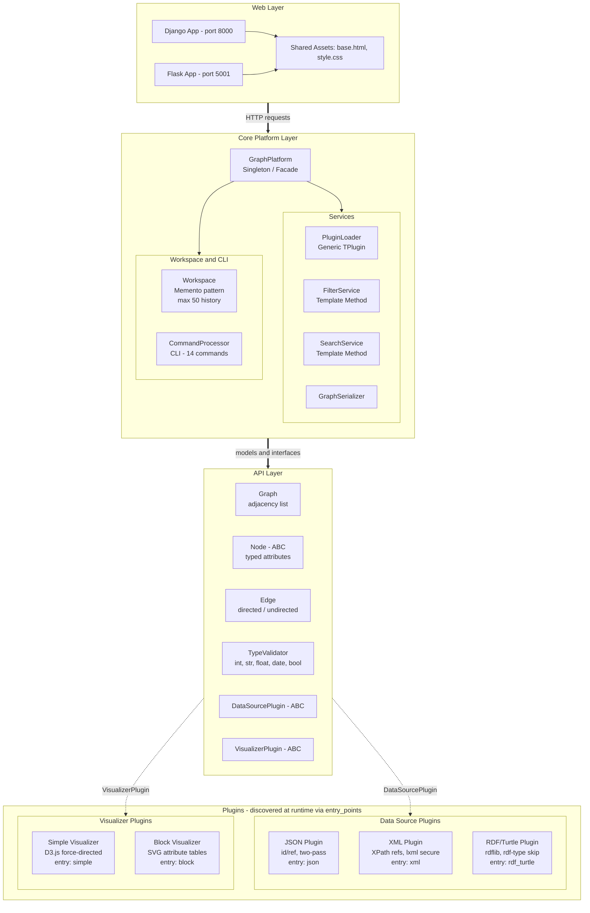
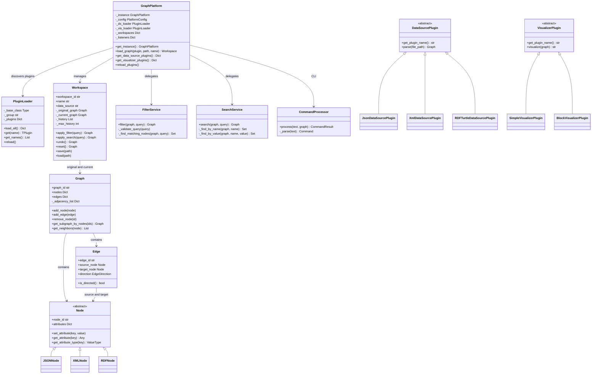
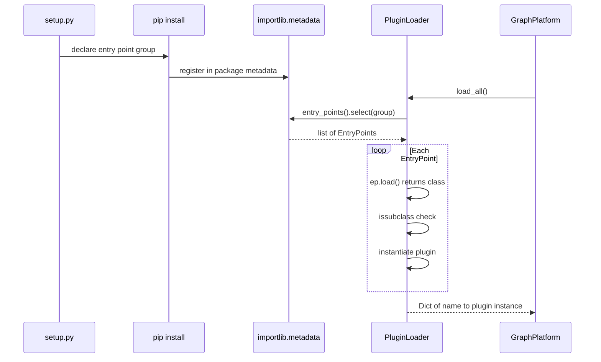


# Graph Structure Visualizer

> A modular, plugin-based platform for parsing, exploring, and visualizing graph structures from heterogeneous data sources — JSON, XML, and RDF/Turtle — with interactive D3.js visualization, multi-workspace management, and a full-featured CLI.

<p align="center">
  <a href="https://github.com/vedranbajic4/graph-structure-visualizer">GitHub Repository</a>
</p>

---

<p align="center">
  
  
  
  
  
</p>


## Team

| Role | Member |
|------|--------|
| Developer | **Milan Sazdov** |
| Developer | **Lazar Sazdov** |
| Developer | **Andrej Dobric** |
| Developer | **Vedran Bajic** |
| Developer | **Luka Stevic** |

---

## Table of Contents

1. [Overview](#overview)
2. [System Architecture](#system-architecture)
3. [Design Patterns](#design-patterns)
4. [Project Structure](#project-structure)
5. [Prerequisites](#prerequisites)
6. [Installation](#installation)
7. [Running the Application](#running-the-application)
8. [Plugin System](#plugin-system)
   - [Data Source Plugins](#data-source-plugins)
   - [Visualizer Plugins](#visualizer-plugins)
9. [Data Format Specifications](#data-format-specifications)
   - [JSON Format](#json-format)
   - [XML Format](#xml-format)
   - [RDF/Turtle Format](#rdfturtle-format)
10. [Web Interface](#web-interface)
11. [CLI Reference](#cli-reference)
12. [Services & Business Logic](#services--business-logic)
13. [Configuration](#configuration)
14. [Testing](#testing)
15. [Test Datasets](#test-datasets)

---

## Overview

Graph Structure Visualizer is a Python platform that loads structured data from multiple file formats, constructs an internal graph representation, and renders interactive visualizations through a web browser. The system is built around a strict **plugin architecture** — data source parsers and visualizers are independently installable Python packages discovered at runtime via `setuptools` entry points.

### Key Capabilities

- **Multi-format ingestion** — JSON (with `@id`/`@ref` cross-references), XML (with XPath-based references), RDF/Turtle (full IRI and literal handling)
- **Two visualization modes** — Force-directed graph (Simple Visualizer) and attribute-table blocks (Block Visualizer), both powered by D3.js v7
- **Three synchronized views** — Main View, Tree View, and Bird's-Eye View with cross-view node selection
- **Multi-workspace management** — Load multiple graphs simultaneously, switch between them, each with independent undo history
- **Interactive operations** — Search by attribute name or value, filter by typed comparisons, full undo/reset
- **CLI interface** — 14 commands for graph manipulation (create/edit/delete nodes and edges, filter, search, undo, reset)
- **Type-aware attributes** — Automatic detection and typed storage of `int`, `float`, `bool`, `date`, and `str` values
- **Dual web framework support** — Django (port 8000) and Flask (port 5001) with identical functionality

---

## System Architecture

### High-Level Layer Overview



### Class Diagram - Core Components



### Plugin Discovery Flow



All plugins are discovered at runtime via Python's `importlib.metadata` entry points — no hardcoded imports. This allows third-party plugins to be installed and detected without modifying core code.

---

## Design Patterns

The platform implements twelve distinct design patterns:

| Pattern | Location | Purpose |
|---------|----------|---------|
| **Singleton** | `GraphPlatform.get_instance()` | One platform instance per process; prevents duplicate plugin loading |
| **Facade** | `GraphPlatform` | Single entry-point for web layer; hides plugin loading, workspace management, and service delegation |
| **Strategy** | `DataSourcePlugin`, `VisualizerPlugin` | Pluggable parsing and rendering algorithms selected at runtime |
| **Template Method** | `GraphQueryService[T]` → `FilterService`, `SearchService` | Common `execute()` skeleton with overridable `_validate_query()` and `_find_matching_nodes()` hooks |
| **Command** | `commands.py` — 14 command classes | Encapsulates graph mutations as objects with `execute()` / `undo()` |
| **Interpreter** | `CommandProcessor.parse()` | Parses CLI text into structured `Command` objects |
| **Observer** | `_listeners` in `GraphPlatform` | Event hooks for `workspace_created`, `workspace_switched`, `graph_updated`, `node_selected` |
| **Memento** | `Workspace._history` | Stores up to 50 graph snapshots for undo/reset operations |
| **Repository** | `GraphPlatform._workspaces` | Dict-based storage hiding workspace persistence details |
| **Service Locator** | `PluginLoader[TPlugin]` | Runtime discovery of plugins via entry-point groups |
| **Factory Method** | `create_data_source_loader()`, `create_visualizer_loader()` | Creates pre-configured `PluginLoader` instances |
| **Generics** | `PluginLoader[TPlugin]`, `GraphQueryService[TQuery]` | Type-safe parametric classes via Python's `typing.Generic` |

---

## Project Structure

```
graph-structure-visualizer/
│
├── api/                                # API Layer — models and plugin interfaces
│   ├── setup.py                        #   package: graph-visualizer-api v1.0.0
│   └── api/
│       ├── __init__.py
│       ├── types.py                    #   TypeValidator (int/str/float/date/bool)
│       ├── models/
│       │   ├── graph.py                #   Graph — adjacency list, subgraph extraction
│       │   ├── node.py                 #   Node (ABC) — typed attribute storage
│       │   └── edge.py                 #   Edge — directed/undirected, EdgeDirection enum
│       └── plugins/
│           └── base.py                 #   DataSourcePlugin (ABC), VisualizerPlugin (ABC)
│
├── core/                               # Core Platform Layer — orchestration & services
│   ├── setup.py                        #   package: graph-visualizer-core v1.0.0
│   ├── graph_platform/
│   │   ├── core.py                     #   GraphPlatform (Singleton/Facade) — 30+ methods
│   │   ├── config.py                   #   PlatformConfig, SerializationConfig
│   │   ├── workspace.py                #   Workspace (Memento) — undo/reset/save/load
│   │   ├── plugin_loader.py            #   PluginLoader[TPlugin] — entry-point discovery
│   │   └── cli/
│   │       ├── command_processor.py    #   CommandProcessor — CLI text parsing
│   │       └── commands.py             #   14 Command classes (create/edit/delete/filter/...)
│   └── services/
│       ├── base_service.py             #   GraphQueryService[T] (Template Method)
│       ├── filter_service.py           #   FilterService — attribute comparison queries
│       ├── search_service.py           #   SearchService — name/value search
│       ├── serialization_service.py    #   GraphSerializer — configurable field output
│       └── exceptions.py               #   FilterParseError, SearchParseError, ...
│
├── data_source_plugin_json/            # JSON Data Source Plugin
│   ├── setup.py                        #   entry point: json → JsonDataSourcePlugin
│   └── data_source_plugin_json/
│       └── plugin.py                   #   Two-pass parsing with @id/@ref resolution
│
├── data_source_plugin_xml/             # XML Data Source Plugin
│   ├── setup.py                        #   entry point: xml → XmlDataSourcePlugin
│   └── data_source_plugin_xml/
│       └── plugin.py                   #   lxml-based, XPath references, secure parsing
│
├── data_source_plugin_rdf/             # RDF/Turtle Data Source Plugin
│   ├── setup.py                        #   entry point: rdf_turtle → RDFTurtleDataSourcePlugin
│   └── data_source_plugin_rdf/
│       └── plugin.py                   #   rdflib-based, URI/Literal handling, rdf:type skip
│
├── simple_visualizer/                  # Simple Visualizer Plugin (force-directed graph)
│   ├── setup.py                        #   entry point: simple → SimpleVisualizerPlugin
│   └── simple_visualizer/
│       └── plugin.py                   #   D3.js force layout, circles, bidirectional edges
│
├── block_visualizer/                   # Block Visualizer Plugin (attribute tables)
│   ├── setup.py                        #   entry point: block → BlockVisualizerPlugin
│   └── block_visualizer/
│       └── plugin.py                   #   SVG foreignObject tables, attribute collapsing
│
├── graph_django_app/                   # Django Web Application (port 8000)
│   ├── manage.py
│   └── graph_django_app/
│       ├── settings.py                 #   TEMPLATES pointed to shared/templates/
│       ├── urls.py                     #   9 API endpoints + index
│       ├── views.py                    #   Upload, search, filter, CLI, workspace management
│       └── wsgi.py
│
├── graph_flask_app/                    # Flask Web Application (port 5001)
│   └── app.py                          #   Identical functionality to Django, no trailing slashes
│
├── shared/                             # Shared frontend assets
│   ├── templates/
│   │   └── base.html                   #   Three-panel UI, D3.js integration, cross-view sync
│   └── static/
│       └── style.css                   #   Complete styling for all views
│
├── tests/                              # Test suite (pytest)
│   ├── conftest.py                     #   Shared fixtures (stub graph: 15 nodes, 25 edges)
│   ├── core_test/                      #   8 test modules for core functionality
│   ├── cli_test/                       #   CLI command tests
│   └── plugin_test/                    #   Plugin integration tests
│       └── fixtures/                   #   Test data files (JSON, XML, TTL)
│
├── requirements.txt                    #   Top-level dependencies
├── setup.bat                           #   Windows setup script
├── setup.sh                            #   Ubuntu/Linux setup script
├── run.bat                             #   Windows run script
└── run.sh                              #   Ubuntu/Linux run script
```

---

## Prerequisites

| Requirement | Version |
|-------------|---------|
| Python | ≥ 3.8 |
| pip | Latest recommended |
| Git | Any recent version |
| OS | Windows 10/11 or Ubuntu 20.04+ |

No additional system packages are required. All Python dependencies are installed automatically during setup.

---

## Installation

### Windows

```powershell
# 1. Clone the repository
git clone https://github.com/vedranbajic4/graph-structure-visualizer.git
cd graph-structure-visualizer

# 2. Run the automated setup script
setup.bat
```

### Ubuntu / Linux

```bash
# 1. Clone the repository
git clone https://github.com/vedranbajic4/graph-structure-visualizer.git
cd graph-structure-visualizer

# 2. Make the script executable and run it
chmod +x setup.sh
./setup.sh
```

### What the Setup Script Does

The setup script performs the following operations in order:

1. **Creates a Python virtual environment** (`venv/`) in the project root
2. **Activates the virtual environment**
3. **Installs top-level dependencies** from `requirements.txt`:
   - `Django>=4.2` — Web framework (primary)
   - `Flask>=3.0` — Web framework (alternative)
   - `rdflib>=6.0.0` — RDF/Turtle parsing
   - `lxml>=5.0.0` — XML parsing with security configuration
   - `pytest>=7.0` — Test runner
4. **Installs all 7 packages** in editable mode (`pip install -e`), in dependency order:

   | Order | Package | PyPI Name |
   |-------|---------|-----------|
   | 1 | API | `graph-visualizer-api` |
   | 2 | Core | `graph-visualizer-core` |
   | 3 | JSON Plugin | `data-source-plugin-json` |
   | 4 | XML Plugin | `data-source-plugin-xml` |
   | 5 | RDF Plugin | `data-source-plugin-rdf-turtle` |
   | 6 | Simple Visualizer | `simple-visualizer` |
   | 7 | Block Visualizer | `block-visualizer` |

5. **Runs Django migrations** (`python manage.py migrate`) for the Django app

> **Important:** The API package must be installed before Core, and Core before any plugins. The setup script handles this ordering automatically.

### Manual Installation (Step-by-Step)

If you prefer to install manually or need to troubleshoot:

```bash
# Create and activate virtual environment
python -m venv venv

# Windows:
venv\Scripts\activate
# Linux/macOS:
source venv/bin/activate

# Install dependencies
pip install -r requirements.txt

# Install packages in order (editable mode)
pip install -e api/
pip install -e core/
pip install -e data_source_plugin_json/
pip install -e data_source_plugin_xml/
pip install -e data_source_plugin_rdf/
pip install -e simple_visualizer/
pip install -e block_visualizer/

# Run Django migrations
cd graph_django_app
python manage.py migrate
cd ..
```

---

## Running the Application

### Windows

```powershell
# Start Django server (default, port 8000)
run.bat django

# Start Flask server (port 5001)
run.bat flask

# Run test suite
run.bat test

# Reinstall all packages (after code changes)
run.bat reinstall
```

### Ubuntu / Linux

```bash
# Start Django server (default, port 8000)
./run.sh django

# Start Flask server (port 5001)
./run.sh flask

# Run test suite
./run.sh test

# Reinstall all packages
./run.sh reinstall
```

### Accessing the Application

| Framework | URL | Default Port |
|-----------|-----|-------------|
| Django | `http://127.0.0.1:8000/` | 8000 |
| Flask | `http://127.0.0.1:5001/` | 5001 |

Both frameworks serve identical functionality using the same shared templates and static assets.

---

## Plugin System

The platform uses Python's `setuptools` entry-point mechanism for plugin discovery. Plugins are organized into two groups:

| Entry Point Group | Purpose | Base Class |
|-------------------|---------|------------|
| `graph_visualizer.data_source` | File format parsers | `DataSourcePlugin` |
| `graph_visualizer.visualizer` | Graph renderers | `VisualizerPlugin` |

### Plugin Discovery Flow

```
setup.py (entry_points)  →  pip install -e  →  importlib.metadata  →  PluginLoader[T]
```

1. Each plugin declares its entry point in `setup.py`
2. Upon `pip install -e`, the entry point is registered in Python's package metadata
3. At runtime, `PluginLoader[TPlugin]` scans the appropriate entry-point group
4. Each discovered class is validated against the base class (`issubclass` check)
5. Valid plugins are instantiated and cached in the loader's internal registry

### Data Source Plugins

| Plugin | Entry Point Key | Class | Dependencies |
|--------|----------------|-------|--------------|
| JSON Parser | `json` | `JsonDataSourcePlugin` | *(none — stdlib only)* |
| XML Parser | `xml` | `XmlDataSourcePlugin` | `lxml >= 6.0.0` |
| RDF/Turtle Parser | `rdf_turtle` | `RDFTurtleDataSourcePlugin` | `rdflib >= 6.0.0` |

### Visualizer Plugins

| Plugin | Entry Point Key | Class | Rendering Technology |
|--------|----------------|-------|---------------------|
| Simple Visualizer | `simple` | `SimpleVisualizerPlugin` | D3.js v7 force-directed layout |
| Block Visualizer | `block` | `BlockVisualizerPlugin` | D3.js v7 + SVG foreignObject tables |

---

## Data Format Specifications

### JSON Format

The JSON plugin uses a **two-pass parsing** algorithm with a custom cross-reference mechanism.

#### Reference System: `@id` and `@ref`

- **`@id`** — Declares a stable identifier for any JSON object. Objects without `@id` receive an auto-generated UUID-based ID (`node_{uuid8}`).
- **`@ref`** — Any string value that matches a known `@id` is automatically treated as a reference edge (no special key needed).

#### Parsing Behavior

| Pass | Operation | Details |
|------|-----------|---------|
| **Pass 1** | ID Registry | Scans the entire JSON tree and collects all `@id` values into an `id_registry` set |
| **Pass 2** | Graph Construction | Builds nodes and edges using the registry for reference resolution |

#### Node Creation Rules

- Every JSON object encountered creates a `JSONNode`
- Node ID is taken from the `@id` field if present; otherwise auto-generated as `node_{uuid8}`
- All scalar attributes (excluding `@id`, `id`, nested dicts, lists, and strings matching `id_registry`) are extracted as typed node attributes

#### Edge Creation Rules

| JSON Structure | Edge Type | Edge Direction | Naming Convention |
|----------------|-----------|----------------|-------------------|
| Nested object (`"key": { ... }`) | Child edge (structural) | Directed | `e{counter}_{key}` |
| Array item (`"key": [{ ... }]`) | Per-item child edge | Directed | `e{counter}_{key}` |
| String matching `id_registry` | Reference edge (cross-link) | Directed | `e{counter}_{key}` |

**Constraint:** Duplicate edges (same source → target with the same label) are automatically prevented.

**Constraint:** All edges created by the JSON plugin are **directed**.

#### Example Input

```json
{
  "@id": "alice",
  "name": "Alice",
  "role": "Engineer",
  "salary": 95000,
  "active": true,
  "employer": "techcorp",
  "colleagues": ["bob", "carol"],
  "department": {
    "@id": "engineering",
    "name": "Engineering"
  }
}
```

**Resulting graph:**
- Node `alice` with attributes `{name: "Alice", role: "Engineer", salary: 95000, active: true}`
- Node `engineering` with attribute `{name: "Engineering"}`
- Edges: `alice → techcorp` (reference), `alice → bob` (reference), `alice → carol` (reference), `alice → engineering` (child)

#### Restrictions

- The input must be valid JSON (parsed with `json.load()`)
- `@id` values must be **unique** across the entire document
- Circular references via `@id`/`@ref` are fully supported (the two-pass algorithm handles cycles)

---

### XML Format

The XML plugin uses `lxml` with a **security-hardened parser configuration** and supports cyclical references via XPath.

#### Parser Security Configuration

```python
etree.XMLParser(
    resolve_entities=False,    # Prevents XXE attacks
    no_network=True,           # No external DTD/entity fetching
    remove_comments=True       # Strips XML comments
)
```

#### Node ID Generation

Each non-reference XML element is assigned a sequential ID based on its local tag name:

```
Person[1], Person[2], Organization[1], ...
```

The ID format is `{localname}[{counter}]` where the counter is per-tag. Namespace prefixes are stripped via `etree.QName(element.tag).localname`.

#### Three-Way Child Element Classification

When processing an XML element's children, each child is classified into one of four categories:

| Category | Detection Rule | Behavior |
|----------|---------------|----------|
| **XML Attribute** | Native XML attributes on the element | Creates an attribute node with `attr:` prefix edge |
| **Reference Wrapper** | Child has exactly one sub-element with a `reference` attribute | Creates a cyclic edge resolved via `tree.getroot().xpath(ref_value)` |
| **Leaf Element** | Child has no sub-elements (`len(child) == 0`) | Treated as an attribute (same as XML attributes); edge prefix: `attr:` |
| **Complex Element** | Child has sub-elements (not a reference) | Recursively processed; edge prefix: `child:` |

#### Edge Naming Conventions

| Prefix | Meaning | Example |
|--------|---------|---------|
| `attr:` | Attribute or leaf-text edge | `attr:Person[1]->name` |
| `child:` | Structural parent→child or reference edge | `child:Person[1]->Organization[1]` |

#### XPath Reference Mechanism

To create cyclic or cross-references, use a wrapper element containing a single element with a `reference` attribute holding an XPath expression:

```xml
<Person>
  <name>Alice</name>
  <works_for>
    <Organization reference="/Graph/Organization[1]"/>
  </works_for>
</Person>
```

**Constraint:** The XPath expression must resolve to **exactly one** element. If zero or multiple elements match, a `ValueError` is raised.

**Constraint:** Leaf element text is stripped (`child.text.strip()`). Empty text becomes an empty string.

**Constraint:** XML attributes on leaf elements (e.g., `<name lang="en">Bob</name>`) are passed as additional edge attributes.

#### Example Input

```xml
<?xml version="1.0" encoding="utf-8"?>
<Graph>
  <Person>
    <name>Alice</name>
    <role>Engineer</role>
    <knows>
      <Person reference="/Graph/Person[2]"/>
    </knows>
    <works_for>
      <Organization reference="/Graph/Organization[1]"/>
    </works_for>
  </Person>
  <Person>
    <name lang="en">Bob</name>
    <role>Designer</role>
    <works_for>
      <Organization reference="/Graph/Organization[1]"/>
    </works_for>
  </Person>
  <Organization>
    <name>TechCorp</name>
  </Organization>
</Graph>
```

**Resulting graph:**
- `Person[1]` → attributes: name="Alice", role="Engineer"
- `Person[2]` → attributes: name="Bob" (with lang="en" on edge), role="Designer"
- `Organization[1]` → attribute: name="TechCorp"
- Edges: `Person[1]→Person[2]` (knows), `Person[1]→Organization[1]` (works_for), `Person[2]→Organization[1]` (works_for)

---

### RDF/Turtle Format

The RDF plugin uses `rdflib` and processes Turtle (`.ttl`) files with a two-pass algorithm.

#### Two-Pass Processing

| Pass | Operation | Details |
|------|-----------|---------|
| **Pass 1** | Node Collection | Every `URIRef` subject → node. Every `URIRef` object → node **unless** predicate is `rdf:type` |
| **Pass 2** | Edge Creation | For triples where both subject and object are `URIRef` and predicate ≠ `rdf:type` → directed edge |

#### `rdf:type` Handling (Critical Business Rule)

- `rdf:type` triples are **completely excluded** from edges
- `rdf:type` objects (e.g., `foaf:Person`, `foaf:Organization`) are **not** added as nodes
- This prevents class/type URIs from cluttering the graph with conceptual nodes

#### URI Local Name Extraction

Node labels are derived from the URI:
1. If the URI contains `#` → take the fragment (e.g., `http://example.org/graph#Alice` → `Alice`)
2. Otherwise → take the last path segment (e.g., `http://example.org/person/Bob` → `Bob`)

#### Literal vs URI Object Handling

| Object Type | Treatment |
|-------------|-----------|
| `rdflib.Literal` | Stored as a **typed attribute** on the subject node (key = predicate local name, value = string) |
| `rdflib.URIRef` (not `rdf:type` target) | Creates a **separate node** connected by a **directed edge** |

#### Edge ID Format

```
e{counter}_{predicate_local_name}
```

Example: `e1_knows`, `e2_works_for`, `e3_manages`

**Constraint:** All edges are **directed** (following RDF semantics where subjects relate to objects).

**Constraint:** The input file must be valid Turtle syntax. Parsing errors from `rdflib` propagate as exceptions.

#### Example Input

```turtle
@prefix ex:   <http://example.org/graph#> .
@prefix rel:  <http://example.org/relation#> .
@prefix foaf: <http://xmlns.com/foaf/0.1/> .

ex:Alice a foaf:Person ;
    foaf:name "Alice" ;
    ex:role "Engineer" .

ex:Bob a foaf:Person ;
    foaf:name "Bob" ;
    ex:role "Designer" .

ex:TechCorp a foaf:Organization ;
    foaf:name "TechCorp" .

ex:Alice  rel:knows      ex:Bob .
ex:Alice  rel:works_for  ex:TechCorp .
```

**Resulting graph:**
- Node `Alice` with attributes `{name: "Alice", role: "Engineer"}`
- Node `Bob` with attributes `{name: "Bob", role: "Designer"}`
- Node `TechCorp` with attribute `{name: "TechCorp"}`
- `foaf:Person` and `foaf:Organization` are **NOT** nodes (filtered by `rdf:type` rule)
- Edges: `Alice→Bob` (knows), `Alice→TechCorp` (works_for)

---

## Web Interface

### Page Layout

The application uses a three-panel layout rendered from a shared `base.html` template:

```
┌──────────────────────────────────────────────────────────────────┐
│  Header: "Graph Explorer"   [+ Load Graph]   [Workspace Tabs]   │
│                                     Visualizer: [▼ simple    ]   │
├──────────┬───────────────────────────────────────┬───────────────┤
│          │                                       │  Bird View    │
│  Tree    │            Main View                  │  (minimap)    │
│  View    │         (D3.js canvas)                │               │
│          │                                       │               │
│          │                                       │               │
├──────────┴───────────────────────────────────────┴───────────────┤
│  [Search: ___________] [Filter: ___________]  [Undo] [Reset]    │
│  CLI: > ____________________________________________             │
│  Status bar                                                      │
└──────────────────────────────────────────────────────────────────┘
```

### Three-View Synchronization

All three views stay synchronized via custom DOM events:

| Event | Emitted By | Consumed By | Payload |
|-------|-----------|-------------|---------|
| `node-selected` | Main View (click) | Tree View, Bird View | `{ nodeId }` |
| `sv-positions` | Main View (each tick + zoom) | Bird View | `{ positions[], edges, mainTransform, viewWidth, viewHeight }` |
| `bird-navigate` | Bird View (click) | Main View | `{ graphX, graphY }` |

**Cross-view highlighting (`highlightNodeAllViews`):**

- **Main View** — toggles `.selected` class on the clicked circle/block (orange stroke)
- **Tree View** — highlights the matching `.tree-label` element
- **Bird View** — changes fill to `#e67e22` and increases radius to 5 for the selected node

### API Endpoints

Both Django and Flask expose identical REST endpoints:

| Endpoint | Method | Request Body | Description |
|----------|--------|-------------|-------------|
| `/` | GET | — | Renders the main page |
| `/api/upload/` | POST | `multipart/form-data`: `file`, `plugin_name`, `workspace_name` | Upload and parse a data file |
| `/api/visualizer/` | POST | `{ "visualizer": "simple" }` | Switch visualizer plugin |
| `/api/search/` | POST | `{ "query": "..." }` | Search by attribute name or value |
| `/api/filter/` | POST | `{ "query": "Age >= 30" }` | Filter by attribute comparison |
| `/api/undo/` | POST | `{}` | Undo last operation |
| `/api/reset/` | POST | `{}` | Reset to original graph |
| `/api/cli/` | POST | `{ "command": "..." }` | Execute a CLI command |
| `/api/workspace/switch/` | POST | `{ "workspace_id": "..." }` | Switch active workspace |
| `/api/workspace/delete/` | POST | `{ "workspace_id": "..." }` | Delete a workspace |

> **Note:** Flask endpoints have no trailing slashes (e.g., `/api/upload` instead of `/api/upload/`).

### Standard API Response Shape

```json
{
  "has_graph": true,
  "graph_html": "<div>...rendered HTML from visualizer...</div>",
  "graph_data": {
    "nodes": [{ "id": "...", "attributes": {} }],
    "edges": [{ "id": "...", "source": "...", "target": "..." }]
  },
  "workspace": {
    "workspace_id": "uuid",
    "name": "Workspace Name",
    "nodes": 15,
    "edges": 25
  },
  "workspaces": [{ "workspace_id": "...", "name": "..." }],
  "success": true
}
```

### Upload Flow

1. User clicks **"+ Load Graph"** → upload panel slides open
2. User selects a data source plugin from the dropdown, chooses a file, optionally names the workspace
3. Form is submitted as `multipart/form-data`
4. Server saves the file to `media/uploads/`, calls `platform.load_graph(plugin_name, file_path, workspace_name)`
5. A new `Workspace` is created with the parsed graph
6. Response includes the rendered visualization HTML, graph data, and workspace metadata
7. Client injects the HTML into the Main View, rebuilds Tree View and Bird View

---

## CLI Reference

The CLI is accessible from the bottom toolbar of the web interface. All commands are processed by `CommandProcessor` and dispatched as `Command` objects.

### Command Syntax

```
create node --id=<id> [--property <Key>=<Value> ...]
create edge --id=<id> --property <Key>=<Value> <source_id> <target_id>
edit   node --id=<id> --property <Key>=<Value> [...]
edit   edge --id=<id> --property <Key>=<Value> [...]
delete node --id=<id>
delete edge --id=<id>
filter '<attribute> <operator> <value>'
search '<query>'
clear
undo
reset
info   [node|edge] <id>
list   [nodes|edges]
help
```

### Command Details

| Command | Description | Supports Undo |
|---------|-------------|:------------:|
| `create node` | Creates a new node with optional typed attributes | Yes |
| `create edge` | Creates a directed edge between two existing nodes | Yes |
| `edit node` | Modifies attributes on an existing node | Yes |
| `edit edge` | Modifies attributes on an existing edge | Yes |
| `delete node` | Removes a node and all connected edges | Yes |
| `delete edge` | Removes an edge | Yes |
| `filter` | Applies attribute filter (reduces visible graph) | Via workspace undo |
| `search` | Searches nodes by attribute name/value | Via workspace undo |
| `clear` | Clears the CLI output history | No |
| `undo` | Reverts the last operation | — |
| `reset` | Reverts to the original unmodified graph | — |
| `info` | Displays detailed information about a node or edge | No |
| `list` | Lists all nodes or all edges in the current graph | No |
| `help` | Shows available commands and their syntax | No |

### CLI Output

CLI output is maintained as a rolling history capped at **100 entries**. Each entry contains:
```json
{ "command": "...", "message": "...", "success": true/false }
```

---

## Services & Business Logic

### Filter Service

Filters the graph to a subgraph containing only nodes matching an attribute comparison.

**Query format:**
```
<attribute_name> <operator> <value>
```

**Supported operators:** `==`, `!=`, `>`, `<`, `>=`, `<=`

**Type-aware comparison:** The filter value is automatically converted to the target attribute's detected type (`int`, `float`, `bool`, `date`, `str`) before comparison. If conversion fails, a `FilterTypeError` is raised.

**Compound filters:** Multiple conditions can be joined with `&&`:
```
Age >= 30 && role == Engineer
```

**Behavior:**
- Nodes without the specified attribute are **excluded** (do not match)
- The resulting subgraph includes all matching nodes and only the edges between them
- Each filter operation pushes a snapshot to the workspace's undo history

**Examples:**
```
salary >= 95000          → nodes with salary attribute ≥ 95000
active == true           → nodes with boolean active = true
role != Manager          → nodes where role is not "Manager"
name == Alice            → exact string match on name
```

### Search Service

Two search modes based on query syntax:

| Query Format | Mode | Behavior |
|-------------|------|----------|
| `AttributeName` | By Name | Returns nodes that **have** an attribute matching the name (case-insensitive substring) |
| `AttributeName=Value` | By Value | Returns nodes where the named attribute **contains** the value (case-insensitive substring) |

**Examples:**
```
role                     → all nodes that have a "role" attribute
name=Alice               → nodes where "name" attribute contains "Alice"
Age                      → all nodes with any attribute containing "age" in the key
```

### Serialization Service

The `GraphSerializer` provides configurable field inclusion/exclusion for graph export:

| Configuration | Default | Effect |
|--------------|---------|--------|
| `include_node_fields` | `None` (all) | Whitelist of node attribute keys to serialize |
| `exclude_node_fields` | `set()` | Blacklist of node attribute keys to skip |
| `include_edge_fields` | `None` (all) | Whitelist of edge attribute keys |
| `exclude_edge_fields` | `set()` | Blacklist of edge attribute keys |
| `include_types` | `True` | Whether to include `attribute_types` in output |
| `date_format` | `"iso"` | strftime format or `"iso"` for dates |

**Field resolution:** `effective_fields = (include ∩ available) − exclude`

---

## Configuration

### Platform Configuration

```python
PlatformConfig(
    serialization=SerializationConfig(...),
    max_history_depth=50,          # Max undo snapshots per workspace
    default_visualizer=None,       # Entry-point name (e.g., "simple")
    default_data_source=None       # Entry-point name (e.g., "json")
)
```

### Visualizer Rendering Configuration

#### Simple Visualizer (Force-Directed Graph)

| Parameter | Value | Description |
|-----------|-------|-------------|
| Link distance | `120` | Ideal distance between connected nodes |
| Charge strength | `-300` | Repulsion force between all nodes |
| Collision radius | `20` | Minimum distance between node centers |
| Node radius | `10` | Circle radius in pixels |
| Zoom range | `[0.1, 8]` | Min/max zoom scale |
| Node colors | `d3.schemeCategory10` | 10-color categorical palette, applied as `color(i % 10)` |
| Edge stroke | `#999`, opacity `0.6`, width `1.5px` | Default edge line styling |
| Arrow refX | `10` | Arrow marker offset from target |
| Hover radius | `14` | Node radius on mouseover |
| Tooltip max width | `280px` | Tooltip popup constraint |

**Bidirectional edge handling:** Edges between the same pair of nodes are merged into a single visual line. The forward edge gets `marker-end`, the reverse edge gets `marker-start`. Both labels are shown separately near their respective arrowhead tips.

#### Block Visualizer (Attribute Tables)

| Parameter | Value | Description |
|-----------|-------|-------------|
| Link distance | `100` | Ideal distance between connected blocks |
| Charge strength | `-300` | Repulsion force |
| Collision radius | Dynamic | `Math.sqrt(width² + height²) / 2` (diagonal half-length) |
| Table background | `white` | Block background color |
| Header colors | `d3.schemeCategory10` | Header row colored by category |
| Box shadow | `0 1px 3px rgba(0,0,0,0.15)` | Block shadow |
| Key column width | `45%` | Attribute name column |
| Value column width | `55%` | Attribute value column |

**Attribute collapsing logic:** Nodes whose attributes contain a `value` key are **collapsed** into their parent node's attribute table. Edges with IDs starting with `attr` are filtered out from the visual edge list. This effectively flattens XML-style attribute relationships back into a readable table format.

---

## Testing

### Running Tests

```bash
# Windows
run.bat test

# Linux
./run.sh test

# Or directly with pytest
cd graph-structure-visualizer
source venv/bin/activate    # or venv\Scripts\activate on Windows
pytest tests/ -v
```

### Test Structure

| Test Module | Coverage Area |
|-------------|---------------|
| `test_graph.py` | Graph model — add/remove nodes/edges, adjacency, subgraph extraction |
| `test_filter_service.py` | Filter parsing, type-aware comparison, edge cases |
| `test_search_service.py` | Name-based and value-based search, case insensitivity |
| `test_serialization.py` | Field inclusion/exclusion, type export, date formatting |
| `test_workspace.py` | Workspace lifecycle, undo/reset, history depth limits |
| `test_config.py` | Configuration defaults and overrides |
| `test_plugin_loader.py` | Plugin discovery, validation, caching |
| `test_persistence.py` | Workspace save/load to JSON |
| `test_cli.py` | All 14 CLI commands, parsing, undo/redo |
| `test_json_plugin.py` | JSON parsing, `@id`/`@ref` resolution, cycles |
| `test_xml_plugin.py` | XML parsing, XPath references, attribute extraction |
| `test_rdf_turtle_plugin.py` | RDF parsing, URI/Literal handling, `rdf:type` exclusion |

### Test Fixtures

The following test data files are provided in `tests/plugin_test/fixtures/`:

| File | Size | Plugin | Description |
|------|------|--------|-------------|
| `json_graph1.json` | ~1 KB | `json` | Alice/Bob/Carol/TechCorp social network |
| `json_cyclic1.json` | ~0.5 KB | `json` | Parent/children with back-references (cyclic) |
| `test_json.json` | 37 KB | `json` | Large-scale test dataset |
| `xml_graph1.xml` | ~0.8 KB | `xml` | Person/Organization with XPath references |
| `test_xml.xml` | 140 KB | `xml` | Large-scale XML test dataset |
| `simple_graph1.ttl` | ~0.5 KB | `rdf_turtle` | Alice/Bob/Carol/Dave/TechCorp RDF graph |
| `test_rdf.ttl` | 55 KB | `rdf_turtle` | Large-scale Turtle test dataset |

---

## Test Datasets

To test the application with the included fixtures:

1. Start the application (`run.bat django` or `./run.sh django`)
2. Open `http://127.0.0.1:8000/` in a browser
3. Click **"+ Load Graph"**
4. Select the appropriate data source plugin from the dropdown:
   - For `.json` files → select **JSON Parser**
   - For `.xml` files → select **XML Parser**
   - For `.ttl` files → select **RDF Turtle Parser**
5. Choose a file from `tests/plugin_test/fixtures/`
6. Click **Load**

### Recommended Test Scenarios

| Scenario | File | Plugin | Expected Nodes | What to Observe |
|----------|------|--------|----------------|-----------------|
| Basic social graph | `json_graph1.json` | JSON Parser | 5 | Cross-references between people and organization |
| Cyclic references | `json_cyclic1.json` | JSON Parser | 3 | Parent→Child back-references creating cycles |
| XML with XPath refs | `xml_graph1.xml` | XML Parser | 5+ | `knows`, `works_for`, `manages` relationships |
| RDF/Turtle graph | `simple_graph1.ttl` | RDF Turtle Parser | 5 | URI-based nodes, `rdf:type` exclusion, literal attributes |
| Large-scale JSON | `test_json.json` | JSON Parser | Many | Performance with larger dataset |
| Large-scale XML | `test_xml.xml` | XML Parser | Many | Block Visualizer recommended for attribute-heavy data |
| Large-scale RDF | `test_rdf.ttl` | RDF Turtle Parser | Many | Force-directed or block layout with real RDF data |

---

<p align="center">
  <sub>Graph Structure Visualizer — Project</sub><br>
  <sub>Milan Sazdov · Lazar Sazdov · Andrej Dobric · Vedran Bajic · Luka Stevic</sub>
</p>
